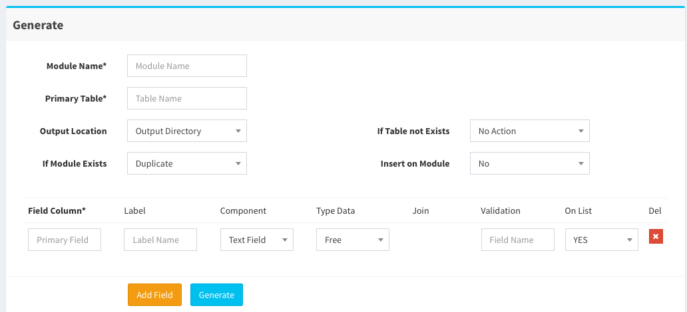
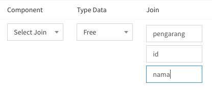

## Fresh Install :
* Untuk menginstall framework ini dapat menggunakan fasilitas wilzard
* Silahkan akses path `[url]/installer`
* Maka akan muncul halaman login
* login : `indoit[bulan saat ini][tahun saat ini]`. Contoh : indoit072016
* Setelah login berhasil silahkan isi textfield, namun sebelumnya pastikan file `Aplication/Config/Database.php` memiliki hak askses 777
* Kemudian Klik Install

## Masuk ke Halaman Admin :
* Setelah berhasil menginstall framework ini anda dapat masuk ke halaman admin dengan cara.
* Akses path `[url]/index.php/backend`
* Defaultnya ada 3 User :
	1. SUPERADMIN. user: super@admin.com, pass: password. User ini adalah user yang paling atas. Hanya diperuntukkan untuk developer. Client tidak perlu tahu user ini. Client juga tidak dapat melihat user ini.
	2. ADMIN. user: admin@admin.com, pass: password. User ini adalah user yang akan di berikan ke client. User ini mendapatkan full access, namun tidak dapat melihat user superadmin, dan tidak dapat menghapus user superadmin.
	3. MEMBER. user: member@admin.com, pass: password. User ini adalah member biasa, tidak dapat create module.

## CRUD Generator :
* Framework ini dilengkapi dengan crud code generator
* Silahkan akses path `[url]/crud_generator` untuk dapat menggunakan fasilitas ini.
* Maka akan muncul halaman login
* login : `indoit[bulan saat ini][tahun saat ini]`. Contoh : indoit072016

#### CRUD Generator : Simple CRUD 
Tampilannya seperti ini :

**Penjelasan Settingan :**
1. Module Nama, di isi dengan nama module. Contoh : buku, mahasiswa, rak, dll
2. Primary Table, di isi dengan nama table utama yang akan di buat CRUD nya. 
3. Ouput Location, adalah setting dimana file hasil generate akan di simpan
	* Output Directory, berarti di simpan di folder [base_url]/crud_generator/output/ (harus di pindah manual ke folder modules)
	* Application Module Directory, berarti langsung di simpan di folder modules yang terletak di [base_url]/Application/Modules/Backend/ 
4. If Module Exists, adalah setting jika folder sudah ada.
	* Duplicate, berarti di duplicate (tidak menimpa)
	* Replace, berarti jika module sudah ada maka akan di timpa.
5. If table not Exists, adalah setting untuk membuat table jika table ternyata belum ada. Jika table sudah ada sebaiknya pilih yang NO ACTION
6. Insert On Module, adalah setting untuk membuat module langsung aktif di sidebar superadmin.

**Penjelasan Field Coloum :**
1. Primary Field, di isi dengan primary key dari tabel.
2. Label, di isi dengan Label. Contoh contoh, nama feildnya : jenkel. Nama labelnya : Jenis Kelamin.
	* Apabila Label tidak di isi maka otomatis label akan mengabil dari nama field.
3. Component, adalah setting tentang komponent apa yang akan digunakan. Kedepannya bisa di isi dengan
	* Textfeild
	* Radio Button
	* Check Box
	* Select 
	* Password
	* Select Join
	* Text area
	* CK Editor
	* Upload
	* dll
4. Tipe data, di isi dengan tipe data yang digunakan. Tipe data free berarti otomatis menyesuaikan.
5. Join, khusus untuk join. Text field hanya akan terisi jika component memilih select joint.
	* Tampilannya kurang lebih seperti ini. 
	
	* Join Table, di isi dengan table yang akan di joinkan.
	* Join Id, di isi dengan id primary key di table yang akan di joinkan.
	* Select, di isi dengan field yang ada di table join yang akan di tampilkan tampilkan di combobox (select).
6. Validation, gunakan untuk setting masing-masing validasi dari setiap kolom/field. Format validasi sesuai dengan format validasi CI. Contoh: required|number
7. On List, digunakan untuk mensetting kolom mana saja yang akan tampil di list (datatables).
